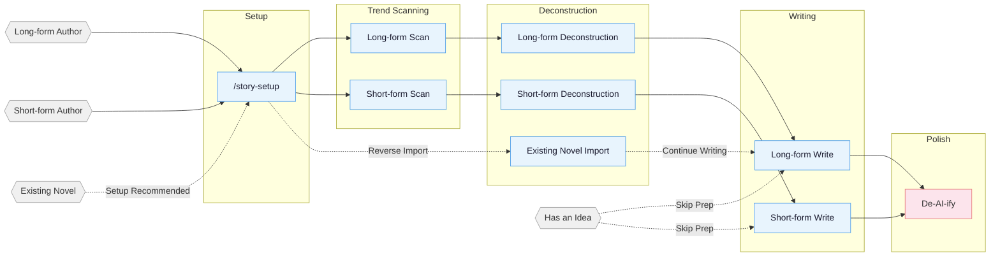

# oh-story-claudecode

An English web-fiction writing skill pack with built-in adapters for Claude Code, OpenCode, ZCode, OpenClaw, Codex CLI, and Reasonix. Web AI / agent environments that can read project files can use the generic skills path. Covers the full pipeline for long-form and short-form English web novels: trend scanning, deconstruction, writing, AI-tone removal, and cover generation.

Unless you explicitly request another language, skill commands communicate with you in Simplified Chinese. This affects conversational replies, progress updates, questions, and reports only; English novel prose and project artifacts remain English according to the book contract.

> **v0.8.0 is the English edition.** All skills, hooks, agents, references, the dashboard, and the project structure are now English (`teardown-lib/`, `tracking/`, `prose/`, `outline/`, `setting/`, `outline_chapter_N.md`, `Chapter N` chapter files, `<!-- deslop:skip -->` exemption marker). Market scanning targets English platforms (Royal Road, Webnovel, Wattpad, Amazon Kindle, Inkitt, Radish, Galatea) plus general web research. **This release ships `agents_version` 23** — deployed projects must re-run `/story-setup` and start a new session, otherwise neither this release's prose rules nor its hooks take effect.

## Core Approach

> **Tropes = deterministic emotional payoff**

Professional authors follow a three-step method:

1. **Scan** — analyze trending charts, identify genres, characters, and entry points.
2. **Deconstruct** — break down pacing and plot materials, build a personal module library.
3. **Commercialize** — learn and apply hooks, payoff density, expectation management.

Built around four pillars: reverse-engineering hits · plot modularization · layered state management · human-AI collaboration.

> Starting in v0.7.2: a local workbench `/story dashboard` — zero production dependencies, bound to `127.0.0.1` only, showing `teardown-lib/` and writing projects as separate file trees with search, Markdown preview, lightweight editing and conflict protection; a fix for stiff prose and summary-style chapter endings caused by copying the outline's shape (an outline specifies *what happens*, not the shape of the prose); and two long-standing session-start false alarms fixed.
>
> For earlier versions, see [CHANGELOG.md](CHANGELOG.md).

## Pipeline Overview



## Installation

**Option 1** Tell Claude Code / OpenCode / ZCode / OpenClaw / Codex / Reasonix, or another Web AI / agent platform that can import a GitHub repo or skill:

```
Install this skill https://github.com/GetZ110/oh-story-claudecode
```

**Option 2** Command line:

```bash
npx skills add GetZ110/oh-story-claudecode -y -g
```

`-g` installs globally (available in every directory); drop `-g` to install only into the current directory. Re-run the same command to update.

<details>
<summary>Codex / ZCode / OpenCode / OpenClaw / Reasonix / Web AI usage notes</summary>

**Codex users:** Use it in-place: Codex scans `$REPO_ROOT/.agents/skills` (a symlink to `skills/`) and discovers all 13 skills; invoke via `$story`, `$story-setup`, or `/skills`. On Windows, enable git `core.symlinks=true` or the symlink breaks — then use the `$story-setup` deployment below.

After `$story-setup` deploys into a writing project, it creates `.codex/agents/*.toml`, `.codex/hooks.json`, `.codex/hooks/{story_codex_hook.py,run-story-hook.sh,run-story-hook.cmd}`, and `.codex/skills/story-setup/references/agent-references/`. Trust the project `.codex/` layer, review/trust hooks in `/hooks`, and open a fresh Codex session so custom agents load.

**ZCode users:** Add this repository as a marketplace in Plugin Management and install `oh-story`; then invoke the 13 Skills/Commands through `$story`, `$story-setup`, or the `/` panel. With `target_cli=zcode`, `$story-setup` deploys `.zcode/skills/`, `.zcode/commands/`, and `.zcode/hooks/story_zcode_hook.js`, then safely merges `.zcode/config.json` and the root `AGENTS.md`. Hooks require `node` on PATH. ZCode 3.3.4 does not execute project/plugin custom agents and has no `PreCompact` or `SessionEnd`; affected workflows report a solo/direct fallback, while `SessionStart` restores context after compaction.

**OpenCode users:** After global install, opencode auto-discovers skills from `~/.claude/skills/`; trigger story-setup with natural language on first use (e.g., "use story-setup to deploy the fiction writing environment"), then **exit and re-enter with `opencode -c`** for slash commands to work. Some hook behaviors differ from Claude Code (session-start / session-end / compact, etc.) — see the OpenCode section in [CONTRIBUTING.md](CONTRIBUTING.md).

**OpenClaw users:** Current support is skills-only. OpenClaw can discover the 13 story skills from workspace `skills/`, `.agents/skills`, `~/.agents/skills`, `~/.openclaw/skills`, or configured extra skill roots. `SKILL.md` files use OpenClaw-compatible single-line `name` / `description` plus single-line JSON `metadata.openclaw`. When `story-setup` targets OpenClaw, it copies the skills into project `skills/` and writes an OpenClaw `AGENTS.md`; agents/hooks are intentionally deferred, so outline-before-prose guards are soft skill checks rather than runtime enforcement. If new skills do not appear immediately, open a fresh OpenClaw session or wait for the skills watcher to refresh.

**Reasonix users:** Current support is Skills + a native plugin manifest. Reasonix natively scans project skill roots (`.agents/skills` etc., a symlink to `skills/`) and discovers all 13 skills — verify with `reasonix doctor capabilities`; you can also `reasonix plugin install` via the root `reasonix-plugin.json`. When `story-setup` targets `target_cli=reasonix`, it copies the skills into project `skills/` and writes a Reasonix `AGENTS.md`; hooks/custom agents are intentionally deferred, so skills needing specialist agents fall back to solo/direct. If Windows symlinks are disabled, use the native plugin instead.

**Generic Web AI / agent users:** If your platform can read a GitHub repo or project files, have the agent read `skills/*/SKILL.md` plus the relevant `references/`. For local project copies, run `story-setup` with `target_cli=generic`; it only writes a generic `AGENTS.md` and `skills/`. Without this project's hooks/custom agents, checks run as skill-level soft constraints or solo/direct fallbacks.

</details>

After updating, if a project has already run `/story-setup`, re-run `/story-setup` from the project root to sync hooks / agents / references. Per-version changes are in [CHANGELOG.md](CHANGELOG.md) and [Releases](https://github.com/GetZ110/oh-story-claudecode/releases).

Codex users: see the complete Chinese usage guide in [docs/codex-usage.md](docs/codex-usage.md), including which commands should run in Plan mode for interactive choices.

**Multi-agent collaboration needs setup + a fresh session:** the 7 specialist agents (story-architect, prose-writer, consistency-checker, etc.) are written into your project's `.claude/agents/` by `/story-setup`, or into `.codex/agents/*.toml` by `$story-setup`. Claude Code and Codex register custom agents most reliably at session start; ZCode 3.3.4, OpenClaw Phase 1, Reasonix Phase 1, and the generic path default to skills + solo fallback. To check Claude/Codex agents: run `/story-review` in the new session — `Effective Mode: full/lean` means agents registered, `Fallback: ... -> solo` means they are unavailable.

**Import and continuation order:** run `/story-setup` from the writing-project root first to deploy hooks, agents, and `AGENTS.md`; start or refresh the session, then run `/story-import` for the existing novel and continue with `/story-long-write daily` or `/story-long-write chapter 21`. You can also run `/story-import` directly; if setup is missing, it offers to run setup first or continue with a serial import.

## Skills

| Skill | Trigger | Description |
|:------|:--------|:------------|
| `story-setup` | `/story-setup` / `$story-setup` | Environment setup — Claude/OpenCode/Codex/ZCode/OpenClaw/Reasonix plus generic (safe merge) |
| `story` | `/story` / `$story` / `/story dashboard` | Toolbox router plus a local deconstruction/project dashboard |
| `story-long-write` | `/story-long-write` | Long-form writing — outline building, character design, prose output |
| `story-long-analyze` | `/story-long-analyze` | Long-form deconstruction — opening hook chapters, payoff design, pacing analysis |
| `story-long-scan` | `/story-long-scan` | Long-form trend scan — Royal Road / Webnovel / Amazon Kindle market trends |
| `story-short-write` | `/story-short-write` | Short-form writing — emotion design, twist crafting, polish & delivery |
| `story-short-analyze` | `/story-short-analyze` | Short-form deconstruction — story core, structure, emotional arc, reversal design, writing techniques, resonance analysis |
| `story-short-scan` | `/story-short-scan` | Short-form trend scan — Wattpad / Inkitt / Radish / Galatea trending data |
| `story-deslop` | `/story-deslop` | De-AI-ify — detect and remove AI writing traces |
| `story-import` | `/story-import` | Reverse import — parse existing novels into standard project structure |
| `story-review` | `/story-review` | Multi-perspective review — 4-agent adversarial review + Royal Road / Webnovel / Kindle scoring rubrics |
| `story-cover` | `/story-cover` | Cover generation — title & genre analysis + GPT-Image-2 image generation |
| `browser-cdp` | `/browser-cdp` | Browser control — CDP protocol for scraping with reusable login sessions |

> `story-deslop` uses local prose linting: blocking applies only to deterministic style/punctuation issues, while other findings require read-through judgment; external detectors are self-check references, not replacements for human review.

Natural language also triggers: `help me start a novel` → `story-long-write`, `this prose sounds like AI` → `story-deslop`, `import my book` → `story-import`, `open the dashboard` → `story dashboard`, `what's the current state of book X` → `story-explorer`.

### Story Dashboard

Run `/story dashboard` (`$story dashboard` in Codex) to open the local writing desk. Browse
deconstruction libraries and long/short project trees, then search, preview Markdown, edit text,
save with conflict protection, or confirm a file deletion. It listens only on `127.0.0.1` and never
uploads story content.


<details>
<summary>Cover generation example</summary>


</details>

<details>
<summary>Deconstruction demo — The Last Knight</summary>

Full output from `/story-long-analyze` deep mode on the first chapters of *The Last Knight* (an English-language demo teardown):

```
demo/teardown-lib/The-Last-Knight/
├── overview.md           # Novel overview + chapter index
├── teardown-report.md    # 5-dimension scoring + pacing analysis + takeaways
├── style.md              # Benchmark voice: sentence rhythm, punctuation, dialogue subtext, emotion pacing
├── chapters/
│   ├── chapter_1_deep-dive.md …   # One deep analysis per opening-hook chapter
│   └── chapter_1_summary.md …     # One summary file per chapter
├── characters/
│   ├── kael.md           # Protagonist full profile
│   ├── maren.md          # Core supporting
│   └── relationships.md  # Relationship network
├── plot/
│   ├── storylines.md     # Framework + plotlines
│   ├── scene-units.md    # Scene-level plot units
│   ├── pacing.md         # Pacing + key-info progression + emotional trigger rhythm
│   └── emotional-beats.md# Reader needs + emotional engine + reusable writing modules
└── setting/
    ├── worldview/
    │   ├── background.md # Core rules + special settings
    │   └── geography.md  # The Shattered Coast
    └── factions/
        └── the-iron-coven.md
```

Long-form deconstruction also produces `style.md`, plus `plot/pacing.md` (pacing, key-info progression, emotional trigger rhythm) and `plot/emotional-beats.md` (reader needs, emotional engine, reusable writing modules); daily writing consumes these through `benchmark/{Book Title}/plot/` to keep voice, pacing, and emotion modules close to the benchmark.

</details>

<details>
<summary>Deconstruction demo — The Secret Keeper (short-form)</summary>

`/story-short-analyze` deconstructing a short story (~6,000 words, win-back / "faked-death" genre):

```
demo/teardown-lib/The-Secret-Keeper/
├── source/source.txt    # Source backup
├── teardown-report.md   # Story core + 5-dim scores + 6-facet payoff + cognitive reversal + resonance layers
├── plot-points.md       # Plot points (source quotes + emotion markers)
├── writing-techniques.md# POV / dialogue / info-gap / object-hook techniques
└── _meta.json           # structure_counts (Phase 7 gate basis)
```

Short-form deconstruction outputs `teardown-report / plot-points / writing-techniques`; downstream `/story-short-write` writes a new same-genre story from them.

</details>

<details>
<summary>Import demo — The Shattered Throne (long-form continuation project)</summary>

Run `/story-setup` first, then use `/story-import` to reverse-build an already-published first 20 chapters into a continuation-ready writing project. Continue with `/story-long-write daily` or `/story-long-write chapter 21`:

```
demo/long-form/The-Shattered-Throne/
├── prose/         chapter_001–020 (published source text)
├── outline/       outline.md · volume_outline_1.md · outline_chapter_001–020.md (one file per chapter)
├── setting/       characters/ (6 character files) · worldview/{background · cheat-system}
│                  relationships.md · genre-positioning.md · style.md
└── tracking/      foreshadowing.md · timeline.md · character-state.md · context.md
```

Per-chapter extraction (events / characters / settings / foreshadowing / timeline) is reverse-engineered into a continuation bible, so the author seamlessly continues from chapter 21.

</details>

## Agent System

Writing skills internally coordinate 7 specialized agents:

| Agent | Model | Role |
|:------|:------|:-----|
| **story-architect** | Opus | Story architecture — genre positioning, outline structure, hook/twist design, emotion arcs |
| **character-designer** | Sonnet | Character design — profiles, voice, motivation chains, dialogue writing |
| **prose-writer** | Sonnet | Prose writer — prose writing, de-AI-ify, format compliance |
| **consistency-checker** | Haiku | Consistency check — fact conflict scanning, foreshadowing tracking, S1-S4 grading reports |
| **story-researcher** | Sonnet | Research — CDP search + full-text extraction, multi-source cross-verification, structured reference files |
| **story-explorer** | Haiku | Story query — read-only character/foreshadowing/setting/progress lookup, quick context loading |
| **chapter-extractor** | Haiku | Chapter extraction — summaries, plot points, character mentions, parallel deconstruction unit |

Agents load writing theory from `references/` on demand (character design, dialogue techniques, twist toolbox, etc. — 100+ methodology files), without reserving context window space.

## Automation Hooks

`/story-setup` deploys 8 automation hooks for Claude Code:

| Hook | Trigger | Function |
|:-----|:---------|:---------|
| session-start.sh | Session start | Display branch, progress snapshot, deconstruction status |
| session-end.sh | Session end | Log session to `tracking/session-log.txt` |
| detect-story-gaps.sh | Session start | Detect setting gaps, missing outlines, foreshadowing breaks |
| pre-compact.sh | Before context compaction | Save progress snapshot path and line-count summary |
| post-compact.sh | After context compaction | Prompt to read progress snapshot for context recovery |
| validate-story-commit.sh | git commit | Check hardcoded attributes, setting required fields (warning only, non-blocking) |
| guard-outline-before-prose.sh | Before writing prose (Write/Edit) | Blocks first creation of a chapter/story body when its `outline_chapter_N.md` / `section-outline.md` is missing (blocking) — enforces outline-first |
| check-prose-after-write.sh | After writing prose (Write/Edit) | Lightly scan for truncation, leaked workflow terms, deterministic toxic phrasing, and word-count debt (advisory) |

## Project File Structure

A long-form novel can easily reach hundreds of thousands of words across hundreds of chapters. Setting conflicts, broken foreshadowing, timeline inconsistencies — relying on memory alone is a recipe for disaster.

The file system separates settings, outlines, prose, and tracking into independent dimensions. The conversation handles creation; the file system handles memory.

**Long-form:**

```
{Book Title}/
├── setting/
│   ├── worldview/          # Background, power systems, etc. — one file per topic
│   ├── characters/         # One file per character (kael.md, maren.md)
│   ├── factions/           # One file per faction/organization (the-iron-coven.md)
│   ├── relationships.md    # Character relationship map
│   └── genre-positioning.md # Core trope + benchmark analysis
├── outline/
│   ├── outline.md          # Full-book volume-level structure
│   ├── volume_outline_1.md # One per volume: payoff pacing + emotion arc + character arc + foreshadowing + twists
│   ├── outline_chapter_001.md # One per chapter: summary + plot points + relationships/order + hooks
│   └── ...
├── prose/
│   ├── chapter_001_Title.md
│   └── ...
├── benchmark/                # Benchmark reference (structured subdirs synced from deconstruction)
│   └── {Benchmark Book}/
│       ├── source/            # Benchmark book original chapters
│       ├── characters/       # Structured character profiles (synced from analyze)
│       ├── plot/             # Structured plot lines/pacing/emotion modules (synced from analyze)
│       ├── setting/          # Structured world settings (synced from analyze)
│       ├── style.md          # Benchmark voice used before daily writing
│       └── teardown-report.md # Analyze skill output
├── tracking/                # Continuity management (layered tracking)
│   ├── context.md           # Writing context (for compact recovery)
│   ├── foreshadowing.md     # Foreshadowing planted/resolved status table (cross-volume)
│   ├── timeline.md          # In-story timeline (full-book)
│   └── character-state.md   # Character current state snapshots (per-chapter)
└── references/              # story-researcher output
    └── {topic}.md           # Split by research topic
```

**Short-form file structure:**

```
{Title}/
├── prose.md                # Final draft
├── section-outline.md      # Section structure + emotion curve
└── setting.md              # Short-form setting sheet
```

**Deconstruction Library:** Deconstruction skills save structured outputs (characters, plotlines, settings, chapters) under `teardown-lib/{Book Title}/` at project root; long-form plot output includes `plot/pacing.md` and `plot/emotional-beats.md`. Writing skills consume these assets through `benchmark/{Book Title}/plot/` and related benchmark subdirectories, or automatically fall back to reading from the deconstruction library.

**`.active-book`:** a text file at project root containing the active book's relative path (for example, `novels/My Novel`). Hooks and writing skills use it to locate the current project.

## Knowledge Base

Each skill includes a `references/` knowledge base loaded on demand to keep context lean.

<details>
<summary>Expand the per-skill knowledge-base topic list</summary>

| Topic | Contents | Skill |
|:------|:---------|:------|
| Outline Layout | Outline method · Story structure levels · Node design · Progression design | long-write |
| Opening Design | Opening patterns · First 500 words · Opening hook chapters | long-write / short-write |
| Character Design | Character profiles · Character extraction · Relationship mapping · Motivation chains · Ensemble casts | long-write / short-write / short-analyze |
| Hook Techniques | 13 chapter-end hooks · 7 chapter-start hooks · Paragraph-level hooks · Suspense orchestration | long-write / short-write / short-analyze |
| Emotion Design | Emotion-arc templates · Expectation management · Genre track strategies | long-write / short-write |
| Genre Frameworks | Long-form structure · Short-form compressed 3-act · Genre opening templates | long-write / short-write / short-analyze |
| Dialogue Techniques | Rhythm · Subtext · Information control · Dialogue pattern database | long-write / short-write |
| Twist Toolbox | Types · Timing · Misdirection base paths | long-write / short-write |
| Style Modules | Dialogue · Combat · Mind games · Cinematic writing · Comeuppance · Plain description | long-write |
| Advanced Techniques | Micro-outlines · Climax reverse-engineering · Dual-thread structure · Interweaving | long-write |
| De-AI-ify | Prevention · 3-pass de-AI method · Rewrite examples · Banned phrase list | deslop / long-write / short-write |
| Quality Checks | General · Long-form specific · Short-form specific · Toxic trope detection | long-write / short-write / short-analyze |
| Writing Formulas | Genre formulas · Escalating reversal · Romance four-stage | short-write / short-analyze |
| Romance-focused Writing | Romance reader preferences · Emotional description · Romance patterns · Benchmark analysis | short-write |
| Deconstruction Methods | Opening hook chapters · Emotion curves · Structure breakdown · Platform style analysis | long-analyze / short-analyze |
| Short-form Methodology | Story core · Plot points · Explosive point analysis · Writing techniques · Rhythm analysis · Resonance analysis · Character classification · Platform fit | short-analyze |
| Deconstruction Examples | Full case breakdowns · Template output | short-analyze |
| Reader Profiles | Reader dimensions · Target reader analysis | long-scan |
| Market Data | Genre trends · Platform characteristics · Collection formats · Submission guides | long-scan / short-scan |
| Cover Styles | Genre visual styles · Color composition · Prompt templates | story-cover |
| Adversarial Review | Multi-perspective review · Scoring rubrics · Toxic trope detection | story-review |

</details>

## Supported Platforms

**Long-form** Royal Road · Webnovel (webnovel.com) · Wattpad · Amazon Kindle (Top 100 / Kindle Unlimited) · Inkitt

**Short-form** Wattpad · Inkitt · Radish · Galatea · Dreame · GoodNovel · Tapas

Real output samples are in [demo/](demo/): short-form deconstruction *The Secret Keeper* · long-form deconstruction *The Last Knight* · long-form continuation project *The Shattered Throne* · cover sample *Sword Dao Supreme*.

I built this skill pack to help me through a job-hunting transition :joy:, and I hope it can help others too.

## Contributing

Contributions are welcome — new skills, knowledge base additions, market data updates. See [CONTRIBUTING.md](CONTRIBUTING.md).

## Community

- **Telegram**: <https://t.me/ohstoryclaudecode> — chat, troubleshooting, and feature discussion.
- **GitHub Discussions**: [ask questions, get help, share workflows](https://github.com/GetZ110/oh-story-claudecode/discussions).

## Acknowledgments

- [LINUX DO - The New Ideal Community](https://linux.do) — Community support
- [Zhuque AIGC Detector CLI](https://github.com/Sophomoresty/zhuque) — External retest reference used during anti-AI-writing experiments
